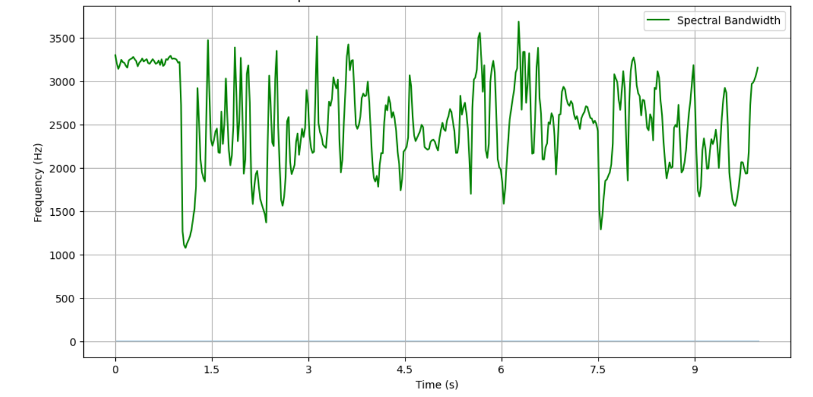
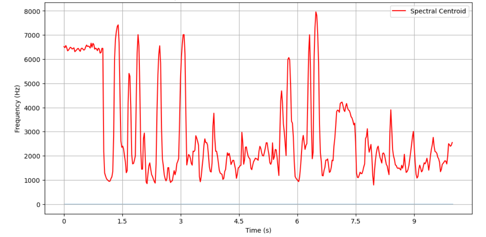
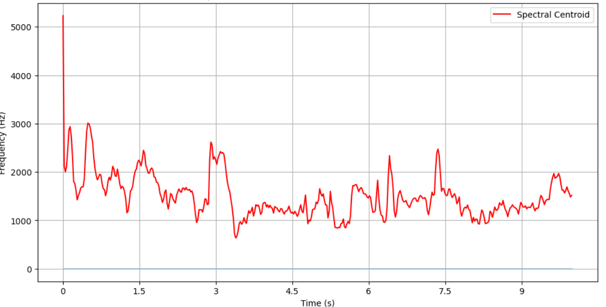
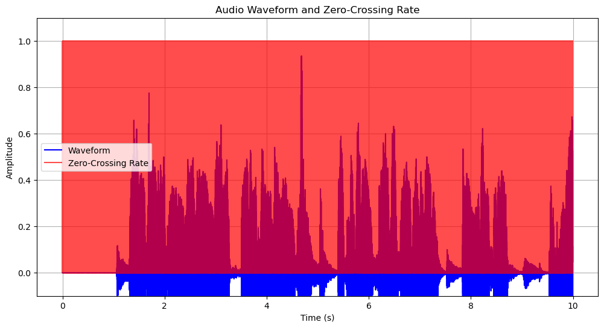
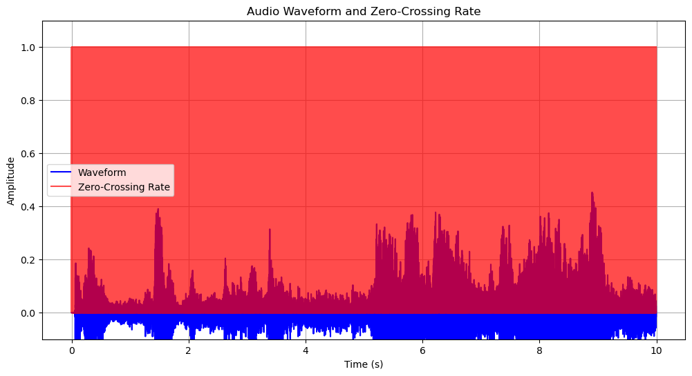

# Cough Detect Pro

Welcome to the Cough Detection and COVID Prediction Streamlit App! This app utilizes machine learning models and the librosa library to analyze audio recordings and classify cough sounds from background noise.  Additionally, to ensure a smooth and informative user experience, we've integrated a guided tour feature using Shepherd.

## Table of Contents

- [Overview](#overview)
- [View the App](#viewapp)
- [Features](#features)
- [Usage](#usage)
- [Model Explanation/My Methodology](#model-explanation)

## Overview

This Streamlit app provides an intuitive interface for users to upload audio recordings containing cough sounds. The uploaded audio files are processed using machine learning algorithms trained on audio data, enabling the app to identify and classify cough sounds accurately.

## APP Preview

https://github.com/sneha-4-22/cough-covid-Detection/assets/112711068/3d95065b-1004-489e-9bac-12d505715478

## Features

- **Cough Detection**: The app utilizes machine learning models trained on audio data to detect cough sounds within uploaded audio recordings.
- **COVID Prediction**: Based on the characteristics of the cough sound, the app can predict whether it may be indicative of COVID or not.
- **Librosa Integration**: Leveraging the librosa library, the app extracts relevant features from the audio recordings to enhance the accuracy of cough detection and COVID prediction.
- **Tour Integration using Shepherd**: Seamlessly navigate through the app with our integrated Shepherd feature. Shepherd acts as your personal guide, leading you through each section of the app and providing detailed explanations along the way.

## Usage

1. **Upload Audio File**: Choose an audio file containing cough sounds from your device.
2. **Detection and Prediction**: The app will process the audio file to detect cough sounds and predict the likelihood of COVID.
3. **View Results**: The results of the analysis, including cough detection outcomes and COVID prediction, will be displayed.

## Model Explanation/My Methodology
After encountering challenges with processing audio datasets, I look into research papers on the same topic and discovered that librosa is widely employed in similar projects. I will try my best to simplify the concept of feature extraction:-

### Mono vs Stereo Audio

- **Mono**: Mono audio means that the sound is combined into a single channel. In the context of cough detection, mono audio may represent a balanced sound where both left and right sides of the audio are equally represented.
- **Stereo**: Stereo audio means that the sound is split into two channels, typically left and right. In the context of cough detection, stereo audio may represent an unbalanced sound where one side is louder than the other, indicating background noise.

### MFCC (Mel-Frequency Cepstral Coefficients)

- MFCCs are a widely used feature representation for audio signals. They capture the spectral characteristics of the audio signal, similar to how human auditory perception works.
- MFCCs are useful for distinguishing between different sounds based on their frequency content. In the case of cough detection, certain patterns in the MFCCs may be characteristic of cough sounds.

|                    |             |
| ---------------------------------------       | ----------------------------------       | 
| **See the cough mffcc coeff plot !**          | **See the non-cough mffcc coeff plot !** | 
### Bandwidth

- Bandwidth refers to the range of frequencies present in an audio signal. In cough detection, the bandwidth of cough sounds may be different from that of background noise or non-cough sounds.
- By analyzing the bandwidth of audio signals, we can identify patterns that are typical of cough sounds.

|             |             |
| ---------------------------------------    | ----------------------------------            | 
| **See the cough Septral bandwidth plot !** | **See the non-cough Septral bandwidth plot !**| 
### Centroid

- The centroid represents the center of mass of the frequency distribution in an audio signal. It provides information about the average frequency content of the signal.
- Differences in centroid values between cough and non-cough sounds can help in distinguishing between them.

|                  |              |
| ---------------------------------------        | ----------------------------------            | 
| **See the cough Septral Centroid coeff plot !**| **See the non-cough Septral centroid plot !** | 
### Zero Crossing Rate

- The zero crossing rate is the rate at which the audio signal changes its sign (i.e., from positive to negative or vice versa). It provides information about the temporal dynamics of the signal.
- Cough sounds may exhibit different zero crossing rates compared to background noise or non-cough sounds, making it a useful feature for classification.

|                     |                   |
| ---------------------------------------       | ----------------------------------             | 
| **See the cough Zreo crossing rate plot !**   | **See the non-cough zero cossing rate plot !** | 

### chroma features

|                        |                      |
| ---------------------------------------       | ----------------------------------             | 
| **See the cough chroma features plot !**      | **See the non-cough chroma features plot !**   | 

